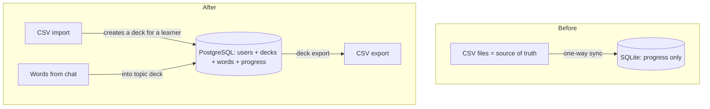
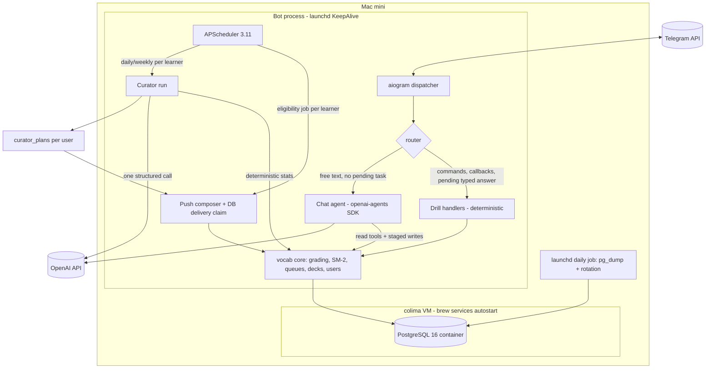
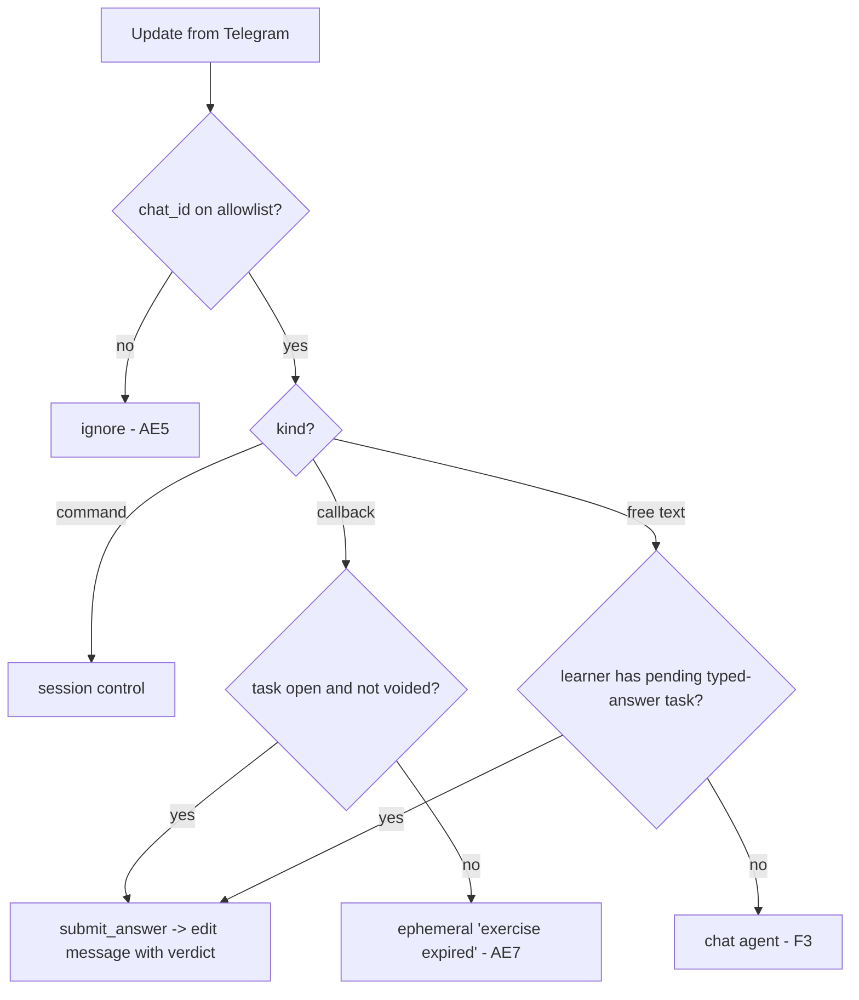

# Telegram Vocabulary Trainer Bot - Plan

> **Architecture supersession (2026-07-21):** KTD10 and the training/tool-parity portion of U5 are superseded by [Deck-scoped Practice, Word Disposition, and Deck Statistics](2026-07-21-001-feat-deck-practice-word-disposition-deck-stats-plan.md). The CLI becomes a manager-only control plane; Telegram and agent adapters call core functions directly, and background jobs are controlled through PostgreSQL-backed requests executed by the bot process.

## Goal Capsule

- **Objective:** turn the existing German vocabulary trainer core (`vocab/`, `cli.py`) into a family Telegram bot (owner + spouse) with three learning modes and an AI agent, running 24/7 on the owner's Mac mini with PostgreSQL storage.
- **Product authority:** the Product Contract in this document; decisions are marked session-settled from the 2026-07-19/20 dialogue.
- **Execution profile:** four phases — core refactor, deterministic bot loop, chat agent, curator + ops. The deterministic loop is a fully usable product before any LLM code lands.
- **Stop conditions:** surface a genuine blocker (contradicts a session-settled decision or changes product scope) instead of guessing; everything else is implementer judgment.
- **Open blockers:** none.

---

## Product Contract

### Summary

A private family Telegram bot for daily vocabulary study, serving two learners (owner and spouse) with fully independent progress: proactive micro-sessions driven by each learner's spaced-repetition schedule, long training sessions on demand, free-form chat with an OpenAI agent (explanations and creating new words from conversation), and a mandatory curator agent that analyzes progress on a schedule and composes push content per learner. The trainer core is upgraded to an Anki-like deck model on PostgreSQL: the database is the single store, CSV is an import/export format, and the data model carries users and languages from day one (German exercise generators ship in v1; new languages arrive as decks plus generator sets).

### Problem Frame

The trainer core (simplified SM-2, 4 exercise types, new/learning/review queues, a JSON CLI that doubles as an agent tool surface) is already built and works in the terminal. But the terminal does not solve the owner's actual problem: consistency. Study must be initiated by the system, happen on the phone in spare 2–3 minute windows, and not depend on the discipline to sit down and practice. Off-the-shelf tools (including Anki-likes) did not cover the combination the owner needs — SRS drills plus a live AI explainer plus vocabulary growth straight from conversation — so the owner is building their own system for the family and wants all needs covered at once, without an intermediate MVP.

### Key Decisions

- **Full scope in v1, no MVP cut.** All three session modes and the curator ship in the first version. (session-settled: user-directed — chosen over a minimal first version: the owner has been through many tools and wants every need covered at once; the curator was explicitly pinned as non-severable.)
- **Multi-user and multi-language in the data model from day one; the spouse joins in v1.** Every progress-bearing table is per-user; decks carry a language. New languages are enabled by adding decks and exercise-generator sets — German ships in v1. (session-settled: user-directed — chosen over a single-user v1 and over schema-only readiness: retrofitting user identity into live progress data is the most expensive possible follow-up.)
- **PostgreSQL (in a colima container) is the single store; CSV is import/export only.** One CSV file = one deck on import. (session-settled: user-directed — chosen over SQLite+WAL, which remains technically sufficient at this scale: multi-user consistency without file-lock tuning, the owner's familiar professional stack, `pg_dump` backups, and colima already running on the Mac mini.)
- **Anki-like decks (topics).** Words are grouped into decks; each deck belongs to one learner and one language; exactly one protected general deck per learner **and language** holds words without a topic; chat-created words go into topic decks. (session-settled: user-directed; per-language cardinality is the schema-level clarification required by multi-language ownership.)
- **SRS × decks — Anki-like hybrid.** Reminders and micro-sessions draw from the learner's global due queue across all their decks; a manual session can be scoped to one deck. (session-settled: user-approved — chosen over "always one global queue" and "session always per-deck".)
- **Exercise difficulty follows the word's stage in every mode.** Micro-sessions may require typed input; buttons are only for the basic memorization stage. (session-settled: user-directed — chosen over button-only micro-sessions: recognition-only checks on mature words distort the SM-2 rating.)
- **"Two loops + curator" architecture.** A deterministic loop runs drills and reminders with no LLM in the cycle; the agent joins in chat mode and on explicit "explain" requests; the curator is a scheduled background agent role. (session-settled: user-approved — chosen over "agent-in-the-middle": per-click latency and cost would hurt the most frequent scenario.)
- **LLM provider — OpenAI.** (session-settled: user-directed — chosen over Anthropic and "decide during planning".)
- **Hosting — the owner's Mac mini, 24/7.** (session-settled: user-directed — chosen over a VPS and "local laptop for now".)
- **Answer grading is deterministic.** The agent explains the trainer's verdict but never overrides it. (session-settled: user-approved — pinned earlier in the session and in `skills/words-trainer-agent-tools/SKILL.md`; chosen over LLM semantic grading: reproducible progress matters more than flexibility.)
- **SRS and exercises are inherited from the existing core.** Simplified SM-2 with stages 0–3, 4 exercise types (multiple choice, flashcards, cloze, grammar), new/learning/review queues. (session-settled: user-directed — chosen earlier in the session over FSRS/Leitner and other exercise sets.)

Storage model shift:

### Actors

- A1. **Learners** — the owner and their spouse; each with their own decks, progress, pushes, sessions, and digests. The owner additionally administers the system.
- A2. **Trainer** — the deterministic core: task generation, grading, SM-2 scheduling, storage.
- A3. **Chat agent** — an OpenAI agent with tool access to the trainer, always acting on behalf of one learner: explanations, topic teaching, word creation.
- A4. **Curator** — the same agent in a scheduled background role, run per learner: progress analysis, push composition, digests.

### Requirements

**Sessions and learning**

- R1. The bot initiates micro-sessions per learner: a push fires when that learner's global due queue has overdue words; a session is 3–5 exercises (fewer when fewer are due — no padding with new words unless the curator plan says so).
- R2. Exercises in every mode match the word's stage. Stage 0 uses recognition-only button choice; deeper stages use the stage-appropriate generators, which may need typed input (article/rection sub-drills stay button-based by design).
- R3. A learner can start a long session at any moment; it continues until they stop and can be scoped to a single deck (deck due words first, then the deck's new words, then the session ends with an explicit "nothing left to study in this deck" message when it starts empty).
- R4. After a trainer verdict the learner can request an explanation; the chat agent receives the task context — payload, the learner's answer, the verdict, the word card. `expected` is never exposed through task surfaces before grading.
- R5. In chat mode the agent explains grammar and words, teaches topics, and offers to create exercises/memos for the topic under discussion.

**Decks, languages, and vocabulary**

- R6. Words are grouped into decks; a deck belongs to one learner and one language; exactly one protected general deck per learner and language holds words without a topic. Learners create topic decks. The agent may propose a new deck; it is created only on learner confirmation.
- R7. CSV import creates or extends one of the importing learner's decks (one file = one deck); re-import is idempotent and never resets progress. When CSV content conflicts with a card modified in the DB after import, the DB wins and the import summary reports the skipped conflict.
- R8. Any deck can be exported to CSV in the same row formats the import accepts.
- R9. Agent-created words from chat get a full card (translation, example sentence, pronunciation; conjugation for verbs; article and plural for nouns) and join the learner's new-word queue inside their topic deck (scheduled by SRS from the first review).
- R10. A language-registry normalized lemma key is unique within one learner's vocabulary per language; an import or confirmed agent card matching an existing key reuses the existing word and its progress and reports the collision — progress never forks. A cross-deck CSV collision keeps the existing deck/card; moving it requires an explicit learner/admin move or confirmation in an agent preview. Normalization preserves display spelling and meaningful orthography: German uses Unicode NFC, trimmed/collapsed whitespace, and lowercase while keeping umlauts/`ß` distinct (`Maße` does not collide with `Masse`); future languages provide their own identity function.
- R11. Exercise generators are registered per language; the German set ships in v1. A deck whose language has no grammar/cloze generators falls back to the language-agnostic types (flashcards, choice).

**Reminders and curator**

- R12. Reminders work per learner off their global due queue; an empty queue sends no push; pushes are suppressed while that learner has an open long session.
- R13. The curator analyzes each learner's data on a schedule and composes their upcoming micro-session content, including drill series that target recurring error patterns.
- R14. The curator sends periodic per-learner progress digests with recommendations.

**Constraints**

- R15. The bot is private: it serves only allowlisted chat_ids (owner and spouse); all other chat_ids are ignored. Learners see only their own data.
- R16. Only the trainer grades answers and writes progress; the agent cannot mark an answer correct around it.
- R17. Drills (R1–R3) run without LLM calls; OpenAI downtime never blocks studying.

**Session and data integrity**

- R18. One active task per learner: issuing a new task atomically voids the previous unanswered one; concurrent interactions may claim a task for grading only once. Interactions with answered, voided, or expired tasks get an "exercise expired" response and never write progress or a second review.
- R19. Tasks expire: an unanswered task is voided after 24 hours or when a newer task is issued for the same word.
- R20. The learner's raw answer text is persisted with every review (feeds R4 explanations and R13 error-pattern analysis).
- R21. Agent-created cards are staged: the bot shows a preview and inserts only on explicit learner confirmation; structural validation (verb = full 3-tense × 6-person conjugation, noun = article + plural, for languages whose validators exist) rejects partial cards before insert.
- R22. Deck lifecycle: rename is metadata-only; the protected general deck cannot be renamed or deleted; deleting a topic deck moves its words to the learner's general deck for the same language with progress intact; moving a word between same-language decks keeps its progress.
- R23. Pushes respect a per-learner minimum interval and quiet hours; a lapse retry (the 10-minute re-queue after a wrong answer) alone never triggers a push. Push eligibility and delivery claims are persisted so a restart or overlapping scheduler run cannot intentionally emit the same push twice.
- R24. Push composition treats the curator plan as an optional overlay: with no fresh plan (first run, failed run, OpenAI outage), pushes fire with the deterministic due-queue composition.

### Key Flows

- F1. Push micro-session
  - **Trigger:** the scheduler finds overdue words in a learner's due queue, the minimum push interval has passed, quiet hours are over, and no long session is open; it atomically claims a persisted delivery key before sending. Composition comes from that learner's fresh curator plan when one exists, deterministic order otherwise (R24).
  - **Actors:** A2 → A1.
  - **Steps:** the bot sends the first exercise; the learner answers (button or text); the trainer grades and shows the verdict; after 3–5 exercises a short session summary follows; on a wrong answer an "explain" affordance is available (→ F3 context).
  - **Covers:** R1, R2, R12, R16, R17, R23, R24.
- F2. Long session
  - **Trigger:** learner command/button, optionally with a deck choice.
  - **Steps:** an unbounded "exercise → answer → verdict" loop; exits on command; summary at the end; an empty deck-scoped start yields one "nothing to study here right now" message.
  - **Covers:** R2, R3, R16, R17.
- F3. Agent chat and word creation
  - **Trigger:** a free-form learner message with no pending typed-answer task, or the "explain" button after a verdict.
  - **Steps:** the agent replies with tool access scoped to that learner (word card, stats, task context); when teaching a new topic it proposes word cards; the bot renders a staged preview; on confirmation the cards land in the topic deck and join the new-word queue.
  - **Covers:** R4, R5, R6, R9, R10, R16, R21.
- F4. Curator cycle
  - **Trigger:** schedule (daily plan run, weekly digest run), executed per learner.
  - **Steps:** deterministic Python analysis of that learner's stats and answer history; one structured LLM call composes the push plan (and digest on digest runs); the plan is stored; the push executor re-validates plan items against the live due queue at send time.
  - **Covers:** R13, R14, R24.

### Acceptance Examples

- AE1. **Covers R2, R16.** Given a mature word (stage 3) in a micro-session, when it comes up in a push, then the exercise is productive (cloze/grammar), not a stage-0 recognition choice; the trainer issues the verdict.
- AE2. **Covers R9, R21.** Given a learner asked in chat to study the topic "visiting a doctor", when the agent proposes words and the learner confirms the preview, then each word has a full validated card, lives in the topic's deck, and joins that learner's new-word queue (reachable via deck-scoped sessions and curator plans).
- AE3. **Covers R1, R12.** Given every word is reviewed and the learner's due queue is empty, when push time arrives, then no push is sent to that learner.
- AE4. **Covers R7.** Given a deck imported from CSV with progress on its words, when the same CSV is imported again, then no duplicates are created and progress is preserved.
- AE5. **Covers R15.** Given a message from a chat_id not on the allowlist, when the bot receives it, then the bot does not reply and writes nothing to the database.
- AE6. **Covers R17, R24.** Given the OpenAI API is down and the last curator run failed, when push time arrives and a learner runs sessions, then pushes and drills work normally with deterministic composition; only explanations and chat are unavailable.
- AE7. **Covers R18, R19.** Given an exercise message from three days ago whose task was voided, when the learner taps its button, then the bot answers with an ephemeral "exercise expired" notice and no progress changes.
- AE8. **Covers R18.** Given a pending typed-answer task, when the learner sends free text, then it is graded as the answer to that task; given no pending task, the same text goes to the chat agent.
- AE9. **Covers R21.** Given the agent generated a verb card with an incomplete conjugation table, when validation runs, then the card is rejected and re-requested; it never reaches the words table.
- AE10. **Covers R15.** Given both learners study in the same hour, when either requests stats or receives a push, then each sees only their own decks, progress, and history.
- AE11. **Covers R18.** Given two callbacks for the same open task arrive concurrently on separate database connections, when both attempt grading, then exactly one review and one SRS transition commit; the other receives the expired response.
- AE12. **Covers R11, R15.** Given both learners have words and one learner has decks in two languages, when an exercise is generated, then its prompt, distractors, expected data, and lookup context contain only the acting learner's target language.
- AE13. **Covers R23.** Given a push job has claimed a delivery and the bot restarts or the scheduler overlaps, when jobs resume, then no second Telegram message is intentionally sent for the same delivery key and the persisted minimum interval remains in force.

### Success Criteria

- Both learners study regularly: most pushes end in a completed micro-session rather than being ignored (accepted baseline; refined from real usage).
- All three modes and the curator are reachable from the phone with no terminal involved.

### Scope Boundaries

- Out of scope: users beyond the two allowlisted learners, voice interfaces, Telegram Mini App / web UI, learner-facing UI languages other than Russian.
- v1 ships exercise generators for German only; adding a language is a follow-up increment (decks + generator set), not a v1 deliverable.
- The trainer core changes only as far as the deck/user/language model, session integrity, and agent word creation require; the SRS algorithm and exercise types are not revisited.

### Deferred to Follow-Up Work

- Second-language generator sets (the registry and fallback ship in v1).
- CSV export as an agent-callable tool (v1: owner command; cheap to add later — read-only).
- Agent editing of existing word cards.
- Deck sharing between learners (v1: separate vocabularies; sharing via CSV export/import).

### Dependencies / Assumptions

- The Mac mini is available 24/7 with Python 3.12+ (uv), colima (Docker runtime), and internet access; auto-login enabled, system sleep disabled, and colima auto-starts at boot (validated at deployment, not assumed).
- The owner will provision one Telegram bot token, an OpenAI API key, and the two private Telegram chat IDs in the protected bootstrap env file. No monthly budget was set: every LLM call is usage-logged per learner, and a local monthly cap is atomically reserved before each call (over cap → skip and notify; final usage reconciles the reservation).
- Initial data: the three CSVs in `data/` load as the owner's three German decks. The git-tracked `progress.sqlite3` contains no progress rows (verified), so there is no SQLite-to-Postgres data migration — initial load is a fresh CSV import; the SQLite file and its code paths are retired.
- Per-learner reminder settings live in the users table and are tuned from real usage; initial values: minimum push interval 3h, quiet hours 22:00–09:00, timezone Europe/Berlin, daily new-word limit 5.

### Sources / Research

- Existing core: `vocab/` (models, storage, SM-2, scheduler, 4 exercise generators), `cli.py` (JSON CLI — the ready tool surface), `tests/test_core.py`.
- Agent tool map and behavior rules: `skills/words-trainer-agent-tools/SKILL.md` (9 tools over the CLI, queue semantics, deterministic-grading rule).
- CSV dictionary formats: `data/*.csv` (nouns with articles, verbs with 18-cell conjugation, verbs with prepositions).
- External (July 2026, verified): aiogram 3.30 / PTB 22.8 docs and changelogs; OpenAI deprecations page (Assistants API sunset 2026-08-26) and pricing page (`gpt-5.4-mini` $0.75/$4.50 per 1M); openai-agents 0.18.3; APScheduler 3.11.3 stable vs 4.0.0a6 "not for production"; Apple launchd docs; docker/for-mac#3567 and #6504 (Docker Desktop/OrbStack cannot run headless — resolved by colima, which runs without a GUI session); Litestream's own cron-backup guidance (moot after the Postgres decision — `pg_dump` replaces it).

---

## Planning Contract

**Product Contract preservation note:** changed twice with owner confirmation — (1) at enrichment: R-IDs tightened and integrity requirements added (flow-analysis findings); (2) post-review scope change: multi-user (spouse in v1), multi-language model, PostgreSQL over SQLite — R6/R9/R10/R11/R12/R15 rewritten, AE10 added, "multi-user" removed from out-of-scope. Doc-review findings folded in: per-user lemma uniqueness (R10), new-queue wording in AE2, deck empty-state (R3/F2), push suppression during long sessions (R12), curator CLI command (U8), import-conflict columns (U1), backup and diagram alignment (HTD/U9), secrets location + .gitignore (U9). The 2026-07-20 implementation-readiness pass then clarified, without changing product scope: schema-enforceable ownership and normalized lemma identity, one general deck per user+language, atomic task grading, generator scoping, separate tutor-text/card-tool schemas, dependency locking and bootstrap, durable delivery claims, async PostgreSQL access, and bounded agent history (AE11–AE13).

### Key Technical Decisions

- **KTD1. Telegram framework: aiogram 3.x (pin `>=3.30,<4`).** Built-in FSM matches drill states, typed `CallbackData` factory keeps callback payloads under the 64-byte limit, router composition separates drill and chat paths. python-telegram-bot v22 is viable but its ConversationHandler mixing of callbacks and messages is a known footgun. Pre-2024 tutorials for either library are version-incompatible.
- **KTD2. OpenAI integration: openai-agents SDK (`~=0.18.0`, locked to the reviewed patch release) over the Responses API.** The Assistants API sunsets 2026-08-26 and must not appear anywhere. The conversational tutor returns normal text; `WordCard` is the strict argument schema for its staged-write tool `propose_words(cards: list[WordCard])`, not the Agent's final `output_type`. The same Pydantic model drives tool-schema validation and DB validation. Model names live in config (default `gpt-5.4-mini` for chat and cards). Disable SDK tracing upload. (Inherits the session-settled "LLM provider — OpenAI".)
- **KTD3. Scheduling: APScheduler 3.11 `AsyncIOScheduler` in-process.** 4.x is still alpha. Start in the bot's `on_startup`; generous `misfire_grace_time` + `coalesce=True`; explicit per-learner timezone; wrap jobs so exceptions are reported to the owner, not swallowed. APScheduler timing is advisory: database delivery claims, not in-memory scheduler state, enforce push intervals and duplicate suppression across overlaps/restarts.
- **KTD4. Deployment: bot under launchd; PostgreSQL under colima.** Docker Desktop/OrbStack cannot run headless on macOS, but colima can (Lima VM, `brew services` autostart) — the database runs as a `postgres:16` container with a named volume; the bot process stays a LaunchAgent with `KeepAlive` and absolute `.venv/bin/python` paths (deploy runs `uv sync --frozen`; never `uv run` as the service entrypoint). `pyproject.toml`, `.python-version`, and `uv.lock` are committed. Secrets and bootstrap chat IDs live in a chmod-600 env file at a fixed path outside the repository (`~/.config/wordsbot/env`); `bot/config.py` explicitly loads that file (override path: `WORDSBOT_ENV_FILE`) before validating settings, while backup/deploy scripts explicitly source it. The repo gains a `.gitignore` covering env files, local databases, logs, and backups. In-app rotating log handler. Deployment checklist validates auto-login, `pmset -a sleep 0`, and colima autostart. (Instantiates the session-settled "Mac mini hosting".)
- **KTD5. Data model: PostgreSQL, schema-enforced per-user and per-language ownership from day one.** `users` has a unique private `chat_id`, timezone/reminder settings, and LLM cap. `decks` has `(user_id, language, normalized_name, is_general)`, `UNIQUE(user_id, language, normalized_name)`, and a partial unique index permitting at most one general deck per `(user_id, language)`; bootstrap and lifecycle functions ensure it exists before words can be created. `words` deliberately carries `user_id`, `language`, and `deck_id`; a composite FK `(deck_id, user_id, language)` to a matching unique key on `decks` guarantees the selected deck has the same owner/language, while `UNIQUE(user_id, language, lemma_key)` enforces R10 without a cross-table index. `word_import_state(word_id PRIMARY KEY, imported_card_hash, imported_at)` records the last accepted CSV card; import conflict detection compares the live card hash with this baseline instead of inferring provenance from timestamps. `tasks` and `sessions` carry `user_id` directly; `tasks(word_id, user_id)` references a matching unique key on `words`, and `reviews.task_id` is unique and non-null. Progress remains one-to-one with a word. `pending_cards`, `curator_plans`/`curator_runs`, `llm_usage`, and `deliveries` are per user. One word belongs to exactly one deck; collisions reuse the existing word and its progress. Numbered SQL migrations run by a small runner at startup. (Instantiates the session-settled "PostgreSQL is the single store".)
- **KTD6. Async DB and availability posture.** The bot and core use psycopg 3 `AsyncConnectionPool`; CLI entrypoints call the same async core through `asyncio.run`, so SQL and connection retry/backoff never block aiogram's event loop. The bot treats Postgres as a hard dependency: on connection failure it retries with bounded asynchronous backoff, notifies `OWNER_CHAT_ID` from bootstrap config once (notification does not depend on a DB lookup), and drops drill interactions with a "storage unavailable" message rather than degrading silently. The Mac mini runs both processes, so co-availability is the norm; the checklist covers container restart.
- **KTD7. Trust boundary invariant.** Only the trainer writes `progress`, `reviews`, and task grading (structurally: grading lives in `scheduler.submit_answer`). Agents get read tools scoped to the acting learner plus exactly two write surfaces: staged card proposals (`pending_cards`, committed by the deterministic confirm handler) and the curator's plan table. No tool ever wraps progress writes; tool output for an unanswered task strips `expected`. (Instantiates the session-settled "grading is deterministic".)
- **KTD8. Curator = deterministic analysis + one structured LLM call, per learner.** Python computes accuracy per word/exercise type, overdue histogram, and error streaks from `reviews` (including raw answers, R20); one structured-output call returns the plan (and digest text on digest runs). Plans land in `curator_plans` (`UNIQUE(user_id, run_date, kind)` — idempotent re-runs); runs logged in `curator_runs` with token usage. The push executor re-validates plan items against the live due queue at send time; deliberate extra-practice drill items are exempt and write SRS progress through the normal path. A plan is fresh only when it is under 24h old and no later scheduled plan run for that learner has failed; failure retains the old row for audit but makes it ineligible, producing the R24 deterministic fallback. Digest delivery uses the same persisted claim mechanism as pushes. No DB-query tools for the curator.
- **KTD9. Message routing order: command → callback → pending-typed-task check (from the DB) → chat agent.** The DB is the source of truth for "is a typed answer pending" per learner; aiogram FSM state is only a routing hint (MemoryStorage is lost on restart).
- **KTD10. Tool-surface parity: vocab function → CLI command → bot/agent tool, in that order.** Every domain/state capability lands in the core and has a diagnostic or admin CLI route first (CLI takes `--user`, defaulting to the owner); external Telegram send/edit effects and OpenAI calls remain adapter-only. `skills/words-trainer-agent-tools/SKILL.md` is updated in the same unit that changes the agent-facing surface.
- **KTD11. Drill message pattern.** On answer: edit the exercise message in place (verdict shown, keyboard removed), then send the next exercise as a new message. Every callback gets an immediate `answerCallbackQuery`; stale taps get the ephemeral "expired" toast (R18/AE7).
- **KTD12. Language-keyed, learner-scoped generator registry.** Exercise generators register per language and receive an immutable `ExerciseContext(user_id, language)` in addition to the word, DB handle, and RNG. Every distractor/candidate lookup is constrained by that context. German provides all four types (current `vocab/exercises/`); unknown languages fall back to flashcards + choice (R11). Card validators follow the same registry.
- **KTD13. Transaction and delivery invariants.** `create_task` takes a per-user transaction lock, voids the old task, and inserts the replacement in one transaction; a partial unique index on `tasks(user_id)` for open status is the final guard. `submit_answer` atomically transitions open → grading/answered, locks the progress row, updates SRS, and inserts the uniquely keyed review in one transaction. `deliveries` records an idempotency key, claim time, status, and Telegram message ID; claim-before-send makes minimum-interval state restart-safe. Telegram provides no atomic DB+send transaction, so an ambiguous crash favors at-most-once delivery (a possibly missed push/digest) over duplicate family notifications; the next eligible period recovers.

### High-Level Technical Design

Component topology — one bot process, one database container, per-learner scheduling:

Inbound message routing (the rule KTD9 encodes):

### Assumptions

- Bootstrap config (`~/.config/wordsbot/env`) carries: bot token, optional OpenAI key + model names, database URL, `OWNER_CHAT_ID`, `SPOUSE_CHAT_ID`, and default monthly LLM cap. Per-learner runtime settings (timezone, push window/interval, quiet hours, daily new-word limit, cap override) live in `users`; an idempotent bootstrap command upserts the two configured identities without overwriting tuned settings and ensures each user's German general deck exists.
- The bot layer takes aiogram, openai-agents, APScheduler, pydantic-settings/python-dotenv; the core takes psycopg 3 + `psycopg_pool` and pydantic (stdlib-only constraint retired with SQLite). All runtime DB APIs are async.
- Tests run against a disposable Postgres database (the same colima container with a unique test database/schema, or `docker compose` test service); no test touches live data. Async core tests use `unittest.IsolatedAsyncioTestCase` and independent pooled connections for race tests.

### Risks & Mitigations

- **openai-agents SDK is pre-1.0** — minor versions break. Mitigation: constrain to `~=0.18.0`, commit `uv.lock`, deploy with `uv sync --frozen`, isolate SDK usage in `bot/agent.py`, keep the fallback of owning the loop on the Responses API.
- **Model lineup churn** (GPT-5.6 landed weeks ago). Mitigation: model names only in config; structured-output schema owned by our Pydantic model, not the prompt.
- **Mac mini sleeps, logs out, or colima fails to start** → pushes stop or the bot loses its DB. Mitigation: deployment checklist validates auto-login + `pmset -a sleep 0` + `brew services` autostart for colima; KTD6 retry-and-notify posture; APScheduler `misfire_grace_time`/`coalesce` absorbs wake-up delays; launchd `KeepAlive` restarts crashes.
- **aiogram FSM state is in-memory** and lost on restart. Mitigation: the DB is the source of truth for pending tasks (KTD9); a restart mid-session degrades to "next exercise", never to wrong grading.
- **Unbounded LLM spend or context growth** (no budget was set; now two users). Mitigation: atomically reserve a conservative per-run budget (covering configured `max_turns` and output ceilings) under a per-user/month DB lock and reconcile actual usage afterward; definite pre-request failures release it, while ambiguous/crashed calls remain charged at the reserved maximum unless explicitly reconciled. Curator is capped at one structured call per learner per run. Chat history has idle expiry and `SessionSettings(limit=40)`/input filtering; `max_turns` separately limits model/tool iterations within one run and is not treated as a history limit.
- **Two learners, one bot token** — a routing bug could leak one learner's data to the other. Mitigation: every core query takes an explicit user scope; AE10 is a standing test; tool registry is constructed per acting learner.
- **Duplicate callbacks and scheduler overlaps** — asyncio handlers and jobs can race even with two users. Mitigation: KTD13 transaction claims and database constraints are authoritative; AE11/AE13 use independent concurrent connections and restart simulation.

---

## Implementation Units

Phase A — core refactor (U1–U5). Phase B — deterministic bot (U6). Phase C — agent (U7–U8). Phase D — ops (U9).

### U1. Postgres foundation: dependencies, schema, migrations

- **Goal:** PostgreSQL replaces SQLite as the single store, with schema-enforced users/languages, async access, locked dependencies, and a foundation ready for U3's initial load.
- **Requirements:** R6, R10, R15, R18–R20, R23 (schema fields); KTD5, KTD6, KTD13.
- **Dependencies:** none.
- **Files:** `pyproject.toml` (new), `.python-version` (new), `uv.lock` (new), `docker-compose.yml`, `vocab/db.py` (rewrite on psycopg 3 async pool), `vocab/migrations/` (numbered SQL), `vocab/models.py`, `tests/test_db.py` (new), `tests/test_core.py` (adapt).
- **Approach:** commit Python/dependency metadata and the resolved lock before importing third-party packages. `docker-compose.yml` runs `postgres:16` with a named volume under colima. Migration runner applies numbered SQL files tracked in `schema_migrations`. Schema v1 follows KTD5: composite deck ownership/language keys and unique normalized deck names; `words(user_id, language, deck_id, lemma, lemma_key, kind, card JSONB, modified_at)` with composite deck FK and `UNIQUE(user_id, language, lemma_key)`; `word_import_state` for accepted CSV baselines; at-most-one general-deck constraint plus lifecycle-guaranteed creation; `tasks(user_id, word_id, status, voided_at)` with composite word ownership FK and one-open-task partial unique index; `reviews(answer, task_id UNIQUE NOT NULL)`; `progress`, `sessions`, `pending_cards`, `curator_plans`, `curator_runs`, `llm_usage` (including reservations), and `deliveries`. `AsyncConnectionPool` opens/closes with bot lifecycle and uses bounded async retry/backoff per KTD6. Initial data load happens via U3 (no SQLite migration — the tracked DB has zero progress rows; SQLite paths are deleted after verification).
- **Test scenarios:** migrations apply cleanly on an empty database and are idempotent on re-run; duplicate `lemma_key` is rejected within one user+language and allowed for another user/language; a word/task cannot reference a deck/word owned by another user/language; the partial index rejects a second general deck for the same user+language; connection helper fails clearly and asynchronously when Postgres is down.
- **Verification:** `uv sync --frozen`; full suite green against the test database; `docker compose up -d` + migration runner from scratch produces the working schema.

### U2. Word lifecycle: creation, validation registry, staging, deck ops

- **Goal:** the first non-CSV write path for words, with per-language validation agents depend on.
- **Requirements:** R6, R9, R10, R21, R22; KTD5, KTD7, KTD12.
- **Dependencies:** U1.
- **Files:** `vocab/words.py` (new), `vocab/languages.py` (new registry), `vocab/exercises/__init__.py`, `vocab/exercises/choice.py`, `vocab/exercises/grammar.py`, `vocab/exercises/cloze.py`, `tests/test_words.py` (new).
- **Approach:** `validate_card(language, kind, fields)` dispatches through the language registry and requires non-empty translation, example, and pronunciation for agent-created cards (German: verb = 3 tenses × 6 persons, noun = article + plural, verb_prep = preposition + case; warn when the example sentence contains no recognizable form of the word). `stage_cards` / `commit_pending` / `reject_pending` implement staging; commit applies the normalized R10 collision rule and moves an existing word only when the confirmed preview explicitly requested it. Deck ops: `ensure_general_deck`, `create_deck`, `rename_deck`, `delete_deck` (words → learner's same-language general deck), `move_word` (same language only); creating/importing the first deck in a language calls `ensure_general_deck` in the same transaction. Generator registry maps language → available exercise types with the R11 fallback and every generator receives `ExerciseContext(user_id, language)`; distractor queries require it. Fix the core crash: `grammar._verb_task` returns None on empty/partial conjugation instead of raising.
- **Test scenarios:** partial/incomplete cards rejected (AE9); valid cards commit and appear in the learner's new queue; German case/whitespace/Unicode-equivalent lemma variants reuse the word and keep progress, while `Maße`/`Masse` remain distinct and the same key across users/languages creates independent words; deck delete moves words to the correct general deck with progress intact; cross-language moves and general-deck mutation are rejected; unknown-language deck yields only flashcard/choice tasks (R11); choice/rection payloads contain no other user/language candidates (AE12); grammar generator on a partial-conjugation word falls back instead of crashing; staged cards survive a process restart.
- **Verification:** `tests/test_words.py` green; a committed card immediately serves a stage-0 task via the scheduler.

### U3. CSV import/export

- **Goal:** deck-scoped import/export matching the ownership model (DB wins), doubling as the initial data load.
- **Requirements:** R7, R8; KTD5.
- **Dependencies:** U1, U2 (validation reused).
- **Files:** `vocab/storage.py`, `cli.py`, `tests/test_import_export.py` (new).
- **Approach:** `import_csv(path, user, deck_name, language)` — parse rows with the existing per-row detection, ensure the same-language general/topic deck invariants, insert new lemma keys into the target deck, and never touch progress. For an existing word in the target deck, compare the live card hash to `word_import_state.imported_card_hash`: unchanged baseline permits a CSV update and advances the baseline; a mismatch means the DB wins and the skipped conflict is reported. An existing word in another deck is reported and left in place with its card/progress unchanged. Agent-created/no-baseline cards likewise require explicit editing rather than silent CSV overwrite. `export_deck(user, deck)` emits the same kind-specific row formats the parser accepts. Initial load: the three `data/*.csv` files into the owner's three German decks.
- **Test scenarios:** import creates deck + words + baselines; re-import → zero adds, zero updates, progress intact (AE4); a changed CSV updates a still-baseline-matching card; re-import after a DB-side card edit reports the conflict and keeps the DB card; importing an existing lemma into another deck reports it without moving/updating; export → import round-trip on a deck with all four word kinds reproduces identical cards; the three real CSVs load with expected counts.
- **Verification:** round-trip test green against the three real CSVs in `data/`.

### U4. Session and task integrity in the core scheduler

- **Goal:** the per-learner invariants that make Telegram interaction safe for SRS data.
- **Requirements:** R1, R3, R12, R18, R19, R23, R24; KTD8 (plan consumption), KTD12, KTD13.
- **Dependencies:** U1, U2.
- **Files:** `vocab/scheduler.py`, `vocab/db.py`, `tests/test_sessions.py` (new).
- **Approach:** all queue and generator-candidate queries take user+language scope. Implement KTD13 transactions: `create_task` acquires the learner lock, voids the old open task, and inserts the new task atomically; `submit_answer` claims one open task, locks/creates its progress row, writes the SRS transition and raw-answer review, and closes the task in one commit; voided/expired/losing concurrent submissions return a distinct expired result. TTL sweep voids tasks older than 24h. `sessions` rows track kind, deck scope, counters; auto-close after 30 idle minutes. Deck-scoped due/new queue variants; micro-session composition = due words only, cap 5; `compose_push(user, plan)` consumes the learner's newest fresh plan, re-validates items, and falls back to deterministic order. `claim_push` atomically enforces min interval + quiet hours + no-open-long-session and creates a persisted `deliveries` row before send; ambiguous post-send crashes are not automatically replayed.
- **Test scenarios:** issuing task B voids task A, answering A returns the expired error and writes nothing (AE7); two independent connections submitting the same task concurrently yield one review and one SRS transition (AE11); two concurrent task creations leave exactly one open task; free-text binding is unambiguous with at most one open task per learner (AE8); two learners' open tasks do not interfere (AE10); deck-scoped session drains deck due → deck new → ends, empty start returns the R3 empty signal; stale plan items already reviewed are dropped; no fresh plan → deterministic fallback (AE6); lapse-retried word does not satisfy push eligibility alone; open long session suppresses push eligibility; concurrent/restarted claims do not issue the same delivery key twice (AE13).
- **Verification:** `tests/test_sessions.py` green; existing scheduler behavior tests still pass under the user scope.

### U5. CLI and agent tool surface update

- **Goal:** every core capability reachable via CLI with user scoping; the documented tool map matches reality.
- **Requirements:** R4 (task context read), R13 (history read); KTD10.
- **Dependencies:** U2, U3, U4.
- **Files:** `cli.py`, `skills/words-trainer-agent-tools/SKILL.md`, `README.md`, smoke additions in `tests/`.
- **Approach:** global `--user` flag (default: owner). New commands: `user bootstrap/list/settings`, `deck list/create/rename/delete/move`, `import <csv> --deck --language`, `export <deck>`, `session start/stop`, `task-context <task_id>` (strips `expected` for unanswered tasks), `history [--word]`, `push compose/claim`, `push-plan get/set`, `propose-words` / `confirm-pending`. `user bootstrap` reads configured owner/spouse chat IDs, idempotently upserts identities/default settings without overwriting tuned rows, and ensures German general decks. SKILL.md gains the new tools, user-scoping semantics, and keeps the deterministic-grading rules. Async commands run through one `asyncio.run(main_async())` boundary.
- **Test scenarios:** each command emits valid JSON against the test database; bootstrap is idempotent and preserves tuned settings; `task-context` on an unanswered task contains no `expected`; `--user` isolation: user A's commands and generated task payloads never return user B's data; parity: every state-changing bot capability in U6–U8 has a core function and diagnostic/admin CLI equivalent.
- **Verification:** smoke script exercises every command; SKILL.md tool table matches `cli.py --help`.

### U6. Telegram bot: deterministic drill loop and pushes

- **Goal:** a fully usable product for both learners — pushes, micro-sessions, long sessions — with zero LLM code.
- **Requirements:** R1, R2, R3, R12, R15, R17, R23, R24; KTD1, KTD3, KTD9, KTD11, KTD13.
- **Dependencies:** U4, U5.
- **Files:** `bot/__init__.py`, `bot/main.py`, `bot/config.py`, `bot/middleware.py` (allowlist + user resolution), `bot/drill.py`, `bot/keyboards.py`, `bot/push.py`, `tests/test_bot_routing.py` (new; pure-helper tests).
- **Approach:** aiogram Dispatcher with routers; outer middleware first checks private chat_id against the two bootstrap-config IDs, so foreign updates are dropped without a DB read/write even during an outage (AE5). For an allowed ID it resolves the persisted user row; if storage is unavailable it can return the KTD6 outage response. Inline keyboards only; `CallbackData` packs `task_id` + option index. Routing per KTD9 with the pending-task check scoped to the resolved learner. Verdict = edit-in-place + keyboard removal, next exercise = new message; every callback answered immediately; expired taps → toast. APScheduler jobs iterate learners: push (atomic eligibility/delivery claim from U4, per-learner timezone/quiet hours), TTL sweep, session auto-close. On send success record Telegram message ID/status; on definite pre-acceptance failure release/retry according to bounded policy; ambiguous timeout remains claimed to favor no duplicate. All DB work awaits the shared async pool.
- **Execution note:** mostly integration wiring; prefer runtime smoke verification (test bot token + test database) over exhaustive unit coverage; unit-test only the pure helpers (routing decision, keyboard packing, push eligibility).
- **Test scenarios:** routing helper quadrants (AE8); callback on voided task → expired path (AE7); non-allowlisted/non-private chat_id dropped before writes (AE5); push eligibility respects interval, quiet hours, and open long sessions per learner; duplicate delivery claim suppresses send (AE13); callback data stays ≤64 bytes.
- **Verification:** manual smoke on a test bot with both test users: receive a push, complete a micro-session, run a deck-scoped long session, tap an old button, restart after a claimed push, and verify the other user sees nothing (AE10/AE13).

### U7. Chat agent: explanations and word creation

- **Goal:** F3 — the LLM joins as a per-learner tool-using tutor with staged writes.
- **Requirements:** R4, R5, R6, R9, R16, R21; KTD2, KTD7, KTD10.
- **Dependencies:** U2, U5, U6.
- **Files:** `bot/agent.py`, `bot/tools.py`, `bot/chat.py` (handlers + staging preview/confirm), `tests/test_agent_tools.py` (new).
- **Approach:** openai-agents SDK conversational Agent whose tool registry is constructed for the acting learner: read tools (word card, stats, due, history, task context, current push plan + last curator log) and one staged write (`propose_words(cards: list[WordCard], deck_proposal=...)`, deck created only on confirm). The tutor's final output remains text; each proposed card is validated first by the strict function-tool argument schema and then by `vocab.words.validate_card` before staging. Per-learner in-memory chat history expires after idle time and is bounded with `SessionSettings(limit=40)` plus an input filter; restart intentionally begins a fresh conversation while DB-backed pending cards survive. `max_turns` separately limits tool/model iterations within one request. The "explain" button carries `task_id` with full post-verdict context. Before each `Runner.run`, a DB transaction atomically reserves a conservative worst-case cost for that learner/month across the configured turn/token ceilings; actual SDK usage reconciles it afterward. Definite failures before API acceptance release the reservation; ambiguous/crashed runs retain the reserved charge for owner inspection rather than silently reopening budget (over cap → polite refusal, drills unaffected).
- **Test scenarios (no network — tools tested directly, LLM mocked):** ordinary tutoring returns text without `WordCard` final-output validation; `propose_words` accepts multiple valid cards and rejects an invalid card before staging (AE9); tools never expose `expected` pre-grading; tools never return another learner's data (AE10); confirm commits, cancel discards, restart mid-staging keeps pending rows; no tool in the registry can write progress/reviews; two concurrent cap reservations cannot exceed the learner's monthly cap; ambiguous reservations continue counting until reconciled; history retrieval is bounded independently of `max_turns`; cap-exceeded path skips the API call.
- **Verification:** live smoke: "explain" after a wrong answer; teach a topic → preview → confirm → word appears in the learner's new queue (AE2 end-to-end); `llm_usage` rows carry the right user.

### U8. Curator: analysis, plan, digest — per learner

- **Goal:** F4 — scheduled per-learner analysis composing pushes and digests, with the fallback already in place.
- **Requirements:** R13, R14, R20, R24; KTD8, KTD10.
- **Dependencies:** U4, U7 (shares OpenAI client, usage logging).
- **Files:** `vocab/analysis.py` (new; deterministic stats), `bot/curator.py`, `cli.py` (`curator-run --user --kind {plan,digest}`), `tests/test_curator.py` (new).
- **Approach:** `analysis.py` computes per-word/per-type accuracy, overdue histogram, error streaks with raw answers — pure Python over one learner's `reviews`. `bot/curator.py` feeds one compact JSON blob per learner to one structured-output call → plan JSON (+ digest text on the weekly kind); upsert into `curator_plans` on `(user_id, run_date, kind)`; `curator_runs` row with status and reconciled token usage. Failure records a failed run, retains the previous plan row for audit but makes it ineligible under KTD8, and notifies the owner. The `curator-run` CLI command (KTD10) triggers a run manually for testing. Digest sending claims `digest:{user_id}:{period}` in `deliveries`; ambiguous send outcomes are not replayed automatically, so there is at most one intentional message per learner/period and a manual CLI rerun can inspect/override a stuck claim.
- **Test scenarios (LLM mocked):** analysis on a seeded DB is deterministic and single-learner-scoped; re-run for the same period upserts (one plan row, one digest claim); concurrent/restarted digest runs do not intentionally send twice; mid-run failure retains the old row but makes U4 compose deterministically; plan items already reviewed are filtered by U4 re-validation; curator never writes outside its plan/run/usage/delivery tables.
- **Verification:** `cli.py curator-run --user owner --kind plan` against the test DB produces an inspectable plan row; next push composes from it; with OpenAI access removed the next push still fires (AE6).

### U9. Deployment and operations on the Mac mini

- **Goal:** bot + database survive reboots, crashes, and disk failures without attention.
- **Requirements:** Dependencies/Assumptions section; KTD4, KTD6.
- **Dependencies:** U6, U7, U8.
- **Files:** `deploy/com.dykhalkin.wordsbot.plist`, `deploy/backup.plist`, `scripts/deploy.sh`, `scripts/backup.sh`, `.gitignore`, `README.md` (ops section), `bot/config.py`, `bot/logging.py` (rotating handler).
- **Approach:** LaunchAgent with `KeepAlive` and absolute `.venv/bin/python -m bot` entrypoint; `bot/config.py` explicitly loads `WORDSBOT_ENV_FILE` (default `~/.config/wordsbot/env`) so launchd never needs to source a shell file. `deploy.sh` explicitly sources/validates that env file, then runs `uv sync --frozen` + `docker compose up -d` + migrations + `user bootstrap` + idempotent import of the three owner's CSV decks + plist install. colima autostart via `brew services start colima`. Secrets plus `OWNER_CHAT_ID`/`SPOUSE_CHAT_ID` live in the chmod-600 env file outside the working tree; `.gitignore` covers env files, `*.sqlite3`, logs, backups (and removes `progress.sqlite3` + `__pycache__` from tracking). `scripts/backup.sh` explicitly sources the same env file and runs a Postgres-16-compatible `pg_dump` with 14-day rotation into an iCloud-synced folder. In-app `RotatingFileHandler`. README checklist: bootstrap identity/deck-count verification, auto-login, `pmset -a sleep 0`, colima autostart, restore-from-backup drill, token/key/chat-ID rotation steps.
- **Execution note:** packaging/config unit — verify by install/runtime smoke, not unit tests (`Test expectation: none — configuration artifacts; verified by the deployment checklist`).
- **Verification:** reboot the mini → colima, Postgres, and the bot all come back without manual action; `launchctl kickstart -k` and `kill -9` recover; `pg_dump` backup restores into a working database.

---

## Verification Contract

| Gate | Command / check | Applies to |
|---|---|---|
| Locked environment | `uv sync --frozen` from a clean checkout | U1 and every deploy |
| Unit tests | `uv run python -m unittest discover -s tests` against a unique disposable test database/schema | every unit; green after each unit lands |
| Schema from scratch | `docker compose up -d` + migration runner on an empty volume | U1, and re-run before first deploy |
| Transaction race | independent connections concurrently create/answer the same learner task; exactly one open task/review/SRS transition survives | U4 and scheduler changes |
| Generator isolation | generated payload/distractors contain only acting user + target language | U2 and generator changes |
| CLI parity smoke | every `cli.py` command (incl. bootstrap and `--user`) returns valid JSON against the test DB | U5, U8, and any later tool change |
| Bot smoke | test-token run with two test users: push → micro-session → long session → stale tap → restart/duplicate claim → foreign chat_id → cross-user isolation | U6, U7, U8 |
| LLM-free guarantee | with no `OPENAI_API_KEY`, pushes and drills fully work (AE6) | U6, U8 |
| Ops drill | reboot survival (colima + Postgres + bot) + `pg_dump` restore | U9 |

No LLM call in any automated test: agent tools and curator analysis are tested directly; model calls are mocked.

## Definition of Done

- All nine units landed in dependency order; the full test suite passes; AE1–AE13 each covered by an automated test or a named smoke step.
- The bot runs on the Mac mini (launchd + colima Postgres), survives a reboot, and has produced for the owner at least one real push micro-session, one long session, one agent word-creation, and one curator plan + digest; the spouse's account is onboarded with its own deck and receives its own pushes.
- The three CSVs are loaded as the owner's German decks with verified counts; SQLite code paths and the tracked `progress.sqlite3` are removed from the repo.
- `pyproject.toml`, `.python-version`, and `uv.lock` are committed; a clean `uv sync --frozen` succeeds; the launchd and backup paths load the protected env file without repository secrets.
- `skills/words-trainer-agent-tools/SKILL.md`, `README.md`, and CLI `--help` agree on the tool surface.
- No abandoned experimental code: dead ends removed from the diff before completion.
