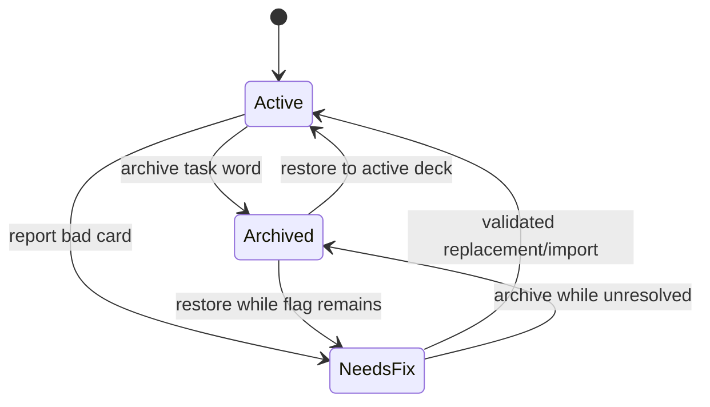

# Deck-scoped Practice, Word Disposition, and Deck Statistics

## Goal Capsule

- **Objective:** close three gaps in the live Telegram trainer: choose a deck before a manual training session, remove or quarantine a bad word without losing history, and inspect activity/progress globally and per deck.
- **User-visible outcome:** `/practice` opens a deck picker; every exercise can be archived or reported as incorrect; `/stats` shows overall and deck-scoped figures including today's review attempts and unique reviewed words.
- **Preserved behavior:** proactive micro-sessions continue to use the learner's global due queue; deterministic grading, SRS transitions, user/language isolation, and one-open-task semantics do not change.
- **Implementation order:** schema and eligibility invariants first, then the manager-only CLI/job control plane, then Telegram UX, statistics, and rollout.
- **Open blockers:** none. The daily-count ambiguity is resolved by showing both review attempts and unique words, plus a seven-day daily series.

---

## Current-State Gaps

1. `sessions.deck_id` already supports deck-scoped sessions in the core, but Telegram `/practice` immediately starts an unscoped long session and exposes no deck picker. The existing CLI session route is implementation residue and will be removed rather than treated as a user surface.
2. A word can be moved between ordinary decks, but there is no protected archive, no study-eligibility state, and no safe action tied to an open Telegram task.
3. `scheduler.stats()` is learner-global. It has no deck filter, no local-calendar-day calculation, and reviews do not snapshot the deck in which the answer happened.

---

## Product Contract

### Requirements

- **R1. Manual deck selection.** `/practice` must offer `All active decks` and each eligible non-archive deck belonging to the acting learner. Selecting a deck starts a long session scoped to that deck.
- **R2. Scope persistence.** The selected `deck_id` is stored in `sessions`; every subsequent task is constrained by the persisted session scope, including after a bot restart. A callback-supplied deck ID is never trusted without learner ownership validation.
- **R3. Push behavior unchanged.** Proactive micro-sessions remain global and due-only. Archive and repair features must not silently turn pushes into deck-scoped sessions.
- **R4. Protected archive.** Each learner may have at most one protected archive deck per language. It cannot be renamed, deleted, imported into, or selected for training.
- **R5. Archive semantics.** Archiving moves the word to the same-learner, same-language archive deck. Progress and review history are preserved, but the word is excluded from new/due/learning/review queues, distractors, pushes, curator candidates, and active-study statistics.
- **R6. Repair semantics.** Reporting an incorrect card keeps it in its current deck, sets `card_status = 'needs_fix'`, records when/from which task it was reported and an optional reason, and excludes it from the same study surfaces as archived words.
- **R7. No false review.** Archive/report actions void the open task but write no review and make no SRS transition. They then continue the current session with the next eligible word.
- **R8. Race safety.** A concurrent answer and archive/report action for the same task must serialize on the task row. Exactly one wins: either one ordinary review is committed, or the task is voided and the disposition is applied.
- **R9. Recovery.** An archived word can be restored to a learner-owned active deck of the same language. A `needs_fix` word can be resolved only through a validated card replacement or a successful changed CSV import; resolving preserves SRS progress and makes an existing progress row due no later than `now()`.
- **R10. Issue visibility.** Telegram `/issues` and the manager CLI list the acting learner's `needs_fix` cards with word ID, deck, report time, reason, and source task ID. No other learner's cards are visible.
- **R11. Overall statistics.** `/stats` retains global active-study totals and adds archived count, needs-fix count, today's review attempts, today's unique reviewed words, and a local-day review series for the last seven days.
- **R12. Per-deck statistics.** The learner can select a deck from `/stats` and see active total/new/studied/due, stages 0–3, seven-day accuracy, today's review attempts, today's unique reviewed words, and the seven-day daily activity series for that deck.
- **R13. Local day.** “Today” and daily buckets use `users.timezone`, not the server timezone or UTC; DST boundaries must be handled with `zoneinfo` and UTC query bounds.
- **R14. Historical deck attribution.** New reviews snapshot `deck_id` at answer time so moving/archiving a word later does not rewrite historical per-deck activity. Existing reviews are backfilled to the word's deck at migration time; that approximation is documented.
- **R15. No training CLI.** CLI is an administrative control plane, not a second trainer adapter. It must not issue/answer tasks, start/stop sessions, expose task answer context, or directly run push/drill delivery logic.
- **R16. Manager CLI scope.** CLI keeps only system/bootstrap, user settings, deck/card/import-export management, issue repair, read-only statistics/history, and background-job management. Telegram handlers and agents call scoped core functions directly; feature parity with CLI is explicitly not required.
- **R17. Single job executor.** CLI job commands may inspect controls/runs, enable or disable schedules, and enqueue a run-now request. Only the live bot process executes in-process jobs that can send Telegram messages or call OpenAI.
- **R18. Job observability.** Each scheduled/manual job attempt records name, trigger, status, timestamps, idempotency key, and bounded error/result data. Manual requests survive CLI exit and bot restart and are claimed once.

### Acceptance Examples

- **AE1 — deck picker.** Given learner A owns decks `A2` and `Doctor`, when they choose `Doctor` under `/practice`, then every task in that session belongs to `Doctor`; learner B's decks and the archive deck are absent from the picker.
- **AE2 — all decks.** Given the learner selects `All active decks`, tasks may come from any of their non-archive decks but never from archived or `needs_fix` words.
- **AE3 — archive from an exercise.** Given an open task for `die Salbe`, when the learner confirms `Archive`, then the task is voided, no review/progress change occurs, the word moves to the German archive deck, and the next task is sent.
- **AE4 — stale action.** Given an exercise was already answered or voided, when its old archive/report button is pressed, then Telegram shows the expired toast and no word state changes.
- **AE5 — answer/action race.** Given answer and archive callbacks arrive concurrently, then the database contains either one review or one archive transition, never both.
- **AE6 — report and repair.** Given a bad card is reported, it disappears from tasks and distractors and appears under `/issues`; after a validated corrected card is saved, the flag clears and the word is eligible again with prior SRS history intact.
- **AE7 — active statistics.** Given a deck has 20 active words, 2 reported words, and 3 archived words, its training statistics count 20; `/stats` separately reports 2 issues and the archive reports 3.
- **AE8 — local day.** Given a Berlin learner answers around UTC midnight, the reviews fall into the correct Europe/Berlin calendar day, including a DST transition day.
- **AE9 — stable deck history.** Given a word was reviewed in `A2` and later moved to `Doctor`, the old review remains attributed to `A2`; future reviews are attributed to `Doctor`.
- **AE10 — training CLI removed.** Given the new version is installed, when an operator invokes `cli.py task`, `answer`, `session`, or `practice`, then argument parsing rejects the command and no task/session/review row is written.
- **AE11 — safe run-now.** Given `push` is enabled, when the operator invokes `cli.py job run push`, then CLI only persists a queued run and exits; the bot claims it once, executes through the normal delivery path, and records the terminal result.
- **AE12 — disabled job.** Given `curator_plan` is disabled, scheduled ticks are recorded as `skipped`, and `job run curator_plan` is rejected unless the operator supplies `--force`.

### Scope Boundaries

- No permanent word deletion and no automatic SRS reset.
- No Telegram card editor in this increment. Repair happens through validated CLI/card import paths; Telegram provides reporting and issue visibility.
- No changes to the SRS algorithm, exercise types, global push cadence, or curator LLM prompt beyond excluding ineligible words.
- No cross-learner deck sharing or archive restore across languages.
- No CLI task generation, grading, practice loop, session control, task-context inspection, direct Telegram send, or direct OpenAI execution.
- The launchd PostgreSQL backup remains an OS-level job and is not managed by the in-process bot job registry.

---

## Key Technical Decisions

### KTD0. CLI is a manager control plane, not feature parity

This decision supersedes KTD10 and the training/tool-parity portion of U5 in the 2026-07-20 plan.

The bot and OpenAI agents already call learner-scoped domain functions directly, so mirroring every interaction through `cli.py` adds parser code, compatibility obligations, and duplicate end-to-end tests without improving the production path.

The retained CLI surface is deliberately narrow:

- **system:** `migrate`, `health`, user bootstrap/settings;
- **content:** deck CRUD/move, CSV import/export/sync, word lookup/archive/restore/flag/fix, pending proposal resolution;
- **read-only insight:** overall/deck stats, review history, issues;
- **jobs:** list/status, enable/disable, enqueue run-now, inspect recent runs.

Remove these training/execution commands and their interactive code paths:

- `task`, `task-new`, `task-learning`, `task-review`;
- `answer`, `task-context`;
- `session start`, `session stop`, `practice`;
- direct `push compose`, `push claim`;
- direct `push-plan set` and direct synchronous `curator-run`.

Core functions remain independently testable; removing a CLI route never removes the domain API used by Telegram or tests. The conversational tutor's function tools are Python wrappers over core functions, not subprocess/CLI wrappers.

### KTD0.1. PostgreSQL-backed job control, one execution runtime

Add a small persistent control plane:

- `job_controls(job_name PRIMARY KEY, enabled, updated_at)` stores schedule enablement;
- `job_runs(id, job_name, trigger, status, idempotency_key, requested_at, started_at, finished_at, error, result)` stores scheduled and manual attempts;
- a partial/ordinary unique constraint on non-null `idempotency_key` prevents the same scheduled period/manual request from being claimed twice.

The bot owns a static job registry with: `push`, `curator_plan`, `weekly_digest`, `task_sweep`, and `session_cleanup`. Split combined scheduler callbacks where necessary so each job can be controlled and observed independently.

CLI behavior:

- `job list` reads registry controls plus last run;
- `job enable|disable <name>` changes future scheduled execution;
- `job run <name>` inserts a queued manual `job_runs` row and returns its ID immediately;
- `job runs [--name ...] [--limit ...]` reads history;
- `job run --force` is required when the schedule is disabled.

A short bot polling job claims queued rows with `FOR UPDATE SKIP LOCKED`, marks them running, executes through the same adapter/context as scheduled runs, and records success/failure. CLI never instantiates `Bot`, calls OpenAI, or sends a delivery itself. Existing delivery idempotency remains the final guard for push/digest messages.

### KTD1. Archive is a special deck, repair is a word status

Add `decks.is_archive BOOLEAN NOT NULL DEFAULT false` with:

- `CHECK (NOT (is_general AND is_archive))`;
- partial uniqueness on `(user_id, language) WHERE is_archive`;
- lifecycle-level protection from rename/delete/import/training selection;
- a lazy `ensure_archive_deck(user_id, language)` helper.

An existing case-insensitive deck named `Archive` is promoted by the migration. `Archive` becomes a reserved deck name afterward.

Add to `words`:

- `card_status TEXT NOT NULL DEFAULT 'active' CHECK (card_status IN ('active', 'needs_fix'))`;
- `needs_fix_at TIMESTAMPTZ`;
- `needs_fix_reason TEXT`;
- `needs_fix_task_id TEXT REFERENCES tasks(id) ON DELETE SET NULL`.

Archive membership and card quality stay independent: moving a flagged word to archive does not erase its issue, and restoring it does not silently mark it fixed.

### KTD2. One explicit eligibility invariant

A word is study-eligible only when:

```text
words.card_status = 'active' AND decks.is_archive = false
```

Every selection surface must apply this invariant: scheduler queues, explicit task lookup, exercise distractors, push composition/claims, curator analysis, deck counts, and default stats. Centralize the SQL predicate/helper where practical and add integration tests for every surface; do not rely on UI filtering alone.

### KTD3. Disposition is task-bound and transactional

`archive_task_word()` and `flag_task_word()` accept `(user_id, task_id, ...)`, lock the task and learner row, require `status = 'open'`, lock the word, apply the disposition, and void the task in one transaction. They never call `submit_answer()` and never write `reviews` or `progress`.

This task-bound API prevents a stale Telegram button from mutating a word after the visible exercise ceased to be authoritative.

### KTD4. Review rows snapshot deck identity

Migration adds nullable `reviews.deck_id BIGINT REFERENCES decks(id) ON DELETE SET NULL` and an index `(user_id, deck_id, created_at DESC)`. Existing rows are backfilled from current word membership; `submit_answer()` writes the word's current non-archive deck ID into each new review.

Per-deck historical metrics use `reviews.deck_id`; present-state totals/stages use current word membership. Deleted decks disappear from the deck picker, while their reviews remain part of global totals with `deck_id = NULL` after deletion.

### KTD5. Daily metrics use explicit UTC bounds

Core stats accepts an optional `now` for deterministic tests. It derives local midnight boundaries with the learner's `ZoneInfo`, converts them to UTC, and queries `reviews.created_at >= start_utc AND < end_utc`. The same helper builds the last seven local-day buckets without assuming every day is 24 hours.

Report both:

- `review_attempts`: number of review rows;
- `unique_words`: `COUNT(DISTINCT word_id)`.

### KTD6. Telegram uses compact, confirmable callbacks

- `/practice` first renders paginated active-deck buttons plus `All active decks`.
- Every task keyboard contains answer controls when applicable and a management row: `🗄 Archive` and `⚠️ Card error`.
- A first tap renders confirmation; the confirm callback carries only task ID + action and remains under Telegram's 64-byte limit.
- `/stats` renders overall metrics and paginated deck buttons; selecting one edits the message with that deck's metrics and a `Back` button.
- `/issues` is read-only and paginated.

---

## Data and State Model



The state diagram is the product view. Physically, `Archived` is deck membership and `NeedsFix` is `words.card_status`, so both conditions can coexist; either condition makes the word ineligible.

---

## Implementation Units

### U1. Migration and domain invariants

- **Files:** `vocab/migrations/004_word_disposition_and_review_deck.sql`, `vocab/words.py`, `vocab/db.py`, `tests/test_db.py`, `tests/test_words.py`.
- **Work:**
  1. Add archive-deck columns/constraints/indexes and promote existing `Archive` decks.
  2. Add word repair fields and review deck snapshot/backfill/index.
  3. Implement `ensure_archive_deck`, reserved-name checks, `archive_task_word`, `flag_task_word`, `restore_word`, `list_word_issues`, and validated `replace_word_card`.
  4. Protect general/archive decks from rename/delete and reject archive targets in normal import/session start.
  5. Make changed validated CSV updates clear `needs_fix`; unchanged imports do not clear it.
- **Tests:** migration from the current schema with existing reviews; idempotence; one archive per learner/language; ownership/language rejection; archive/repair preserve progress; special deck lifecycle protection; CSV correction behavior.

### U2. Eligibility and transactional session behavior

- **Files:** `vocab/scheduler.py`, `vocab/exercises/*.py`, `vocab/curator.py`, `tests/test_sessions.py`, `tests/test_words.py`, `tests/test_curator.py`.
- **Work:**
  1. Apply the eligibility invariant to all queue, lookup, distractor, push, and curator queries.
  2. Validate `start_session(deck_id)` against acting learner ownership and reject archive decks before stopping the current session.
  3. Ensure persisted `sessions.deck_id` remains the sole task scope after selection/restart.
  4. Make answer-vs-disposition races serialize on the task row.
  5. Write `reviews.deck_id` in `submit_answer()`.
- **Tests:** scoped session never leaks another deck; all-decks session skips archived/flagged words; ineligible cards cannot become distractors or pushes; concurrent answer/archive has exactly one outcome; stale action is a no-op.

### U3. Manager-only CLI and job control plane

- **Files:** `cli.py`, `README.md`, `skills/words-trainer-agent-tools/SKILL.md`, `tests/test_cli.py`.
- **Migration:** add `vocab/migrations/005_job_control.sql` with `job_controls` and `job_runs`; seed/upsert known registry names during bot startup so adding a future code-defined job does not require destructive migration edits.
- **Retained/added manager commands:**
  - deck/content: current `deck`, `import`, `sync`, `export`, `word`, proposal resolution;
  - disposition: `word-archive`, `word-restore`, `word-flag`, `word-fix`, `issues`;
  - insight: `stats [--deck ...] [--days 7]`, `history [--word ...]`;
  - jobs: `job list`, `job enable`, `job disable`, `job run [--force]`, `job runs`;
  - system/user: `migrate`, `health`, `user bootstrap/list/settings`.
- **Removed commands:** all `task*`, `answer`, `task-context`, `session`, `practice`, direct `push compose/claim`, `push-plan set`, and direct synchronous `curator-run`.
- **Work:**
  1. Delete interactive practice and training-command parser/dispatch functions instead of hiding them from help.
  2. Remove CLI references from the agent skill; document direct core tool wrappers and the manager-only boundary.
  3. Add a bot job registry, scheduled-run wrapper, queued manual-run claimer, and run recording.
  4. Keep JSON output and global `--user` only where a manager command acts on one learner.
  5. Keep launchd backup management in `scripts/`/operations docs, outside the bot job registry.
- **Tests:** retained commands emit valid JSON and preserve learner scope; removed command names fail parser validation; job requests persist, claim once under concurrent workers, survive restart, respect enable/force rules, and never execute Telegram/OpenAI effects inside the CLI process.

### U4. Telegram deck selection and word actions

- **Files:** `bot/drill.py`, `bot/keyboards.py`, `bot/presentation.py`, `tests/test_bot.py`.
- **Work:**
  1. Change `/practice` from immediate start to a paginated deck picker with active word counts and an `All active decks` option.
  2. Add `PracticeDeckCallback`, ownership validation, empty-deck feedback, and restart-safe session start.
  3. Extend every exercise keyboard with archive/report controls, including typed-answer tasks that currently have no keyboard.
  4. Add confirmation callbacks, immediate callback acknowledgement, expired handling, edit-in-place confirmation, and automatic next-task delivery.
  5. Add `/issues` read-only pagination.
- **Tests:** callback payloads ≤64 bytes; foreign deck callback rejected; archive absent from picker; typed and choice tasks both expose management actions; stale/racing actions do not double-transition.

### U5. Overall and per-deck statistics

- **Files:** `vocab/scheduler.py` (or a new `vocab/statistics.py` if queries become large), `bot/drill.py`, `bot/keyboards.py`, `bot/presentation.py`, `tests/test_stats.py`, `tests/test_bot.py`.
- **Core API:**
  - `stats(database, user_id, deck_id=None, days=7, now=None)`;
  - `deck_stats(database, user_id, days=7, now=None)` for the picker/summary.
- **Response contract:**
  - present-state: active total/new/studied/due and `by_stage`;
  - quality state: `needs_fix`, plus global/per-language archive count;
  - activity: `today.review_attempts`, `today.unique_words`, `reviews_last_7d.accuracy`, and `daily_activity[]` with local ISO dates;
  - deck metadata when scoped.
- **Telegram:** `/stats` shows overall figures first, then active deck buttons; deck view edits the message and supports back/pagination. Archive is summarized but not presented as a trainable deck.
- **Tests:** global figures equal the sum of active deck present-state figures; per-deck review activity follows review snapshots after moves; archived/flagged words excluded from active totals; Berlin local-midnight and DST cases; zero-review accuracy renders as `—` without division errors.

### U6. Rollout and live verification

- **Files:** `docs/operations.md` and deployment notes if commands change.
- **Steps:**
  1. Create a fresh PostgreSQL backup.
  2. Run migration 004 and verify archive/issue/review backfill counts before restart.
  3. Run the full disposable-Postgres suite.
  4. Restart launchd and run `scripts/ops_check.sh`.
  5. Live smoke as owner: deck-scoped session, archive one test word, restore it, report one card, inspect `/issues`, repair it, and compare global/deck/day stats.
  6. Repeat isolation checks for spouse when configured.
- **Rollback posture:** code rollback is safe only after stopping writes from the new bot; migration columns remain in place. Restore from the pre-migration backup only for destructive rollback.

---

## Verification Matrix

| Concern | Verification |
|---|---|
| Schema upgrade | Empty DB + current-schema upgrade + migration idempotence |
| Learner/language isolation | Foreign deck/action callbacks and manager CLI IDs rejected |
| Session scope | Restart during deck session still yields only selected-deck tasks |
| Eligibility | Archive/needs-fix absent from every queue, distractor, push, curator input |
| Atomic actions | Concurrent answer/archive/report produces exactly one terminal outcome |
| Progress safety | Archive/report/restore never delete or reset progress/reviews |
| Historical deck stats | Review remains attributed to answer-time deck after word move |
| Daily counts | Attempts + unique words match local-day boundaries and DST cases |
| Telegram UX | Picker/action/stats callbacks under 64 bytes; stale taps are harmless |
| CLI boundary | Removed training commands are absent; manager commands and direct bot/core behavior remain functional |

---

## Definition of Done

- A learner can start a Telegram long session for all active decks or one chosen deck.
- From an open exercise, a learner can safely archive or report the card and continue training without a false review.
- Archived and `needs_fix` words are excluded consistently from study while retaining progress and history.
- Issues are inspectable and have a validated repair/resolve path.
- `/stats` exposes overall and per-deck present state plus today's attempts/unique words and a seven-day local-day series.
- Review-time deck attribution is stable for all reviews created after migration.
- CLI contains no training/session/grading path; background jobs are managed through persistent controls and executed only by the bot runtime.
- Full tests pass, migration/backup checks succeed, and the live launchd bot completes the smoke workflow.
